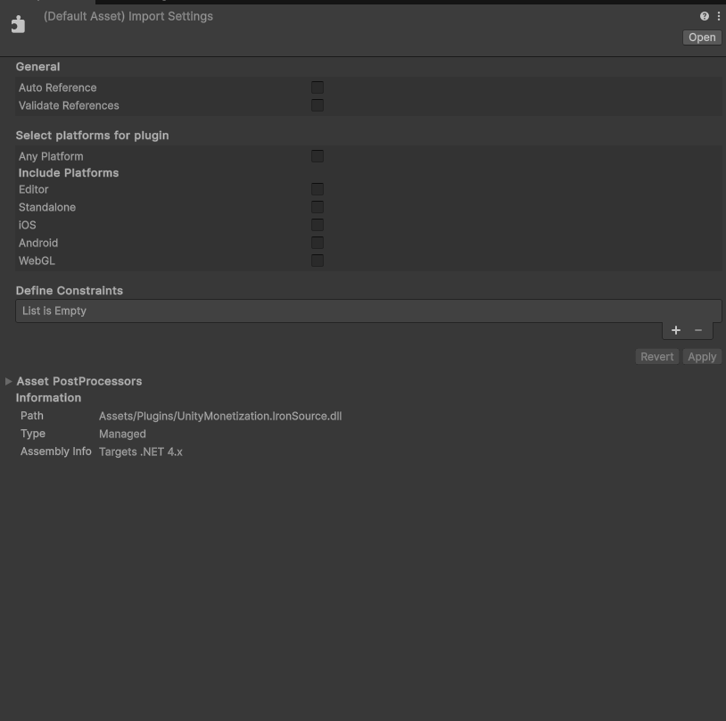
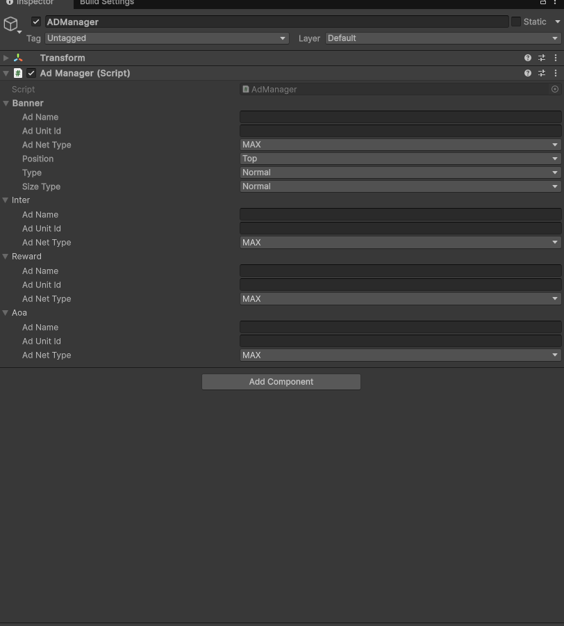

# UnityMonetization

**UnityMonetization** là một thư viện C# giúp nhà phát triển Unity dễ dàng tích hợp và chuyển đổi giữa nhiều mạng quảng cáo khác nhau như **AdMob**, **AppLovin MAX**,... chỉ với một giao diện thống nhất.
Dự án được thiết kế để tiết kiệm thời gian tích hợp và tối ưu hóa luồng doanh thu quảng cáo trong game/app Unity.

---

## 🚀 Tính năng nổi bật

* Hỗ trợ nhiều mạng quảng cáo: **AdMob 9.2.0**, **MAX SDK 8.x**, v.v.
* Thiết kế module mở rộng, dễ dàng thêm hoặc chuyển đổi network.
* Hoạt động với **mọi phiên bản Unity** (thư viện độc lập .dll).
* Tích hợp nhanh chóng chỉ với vài bước đơn giản.
* API thống nhất, giúp giảm thiểu việc viết lại mã khi thay đổi nền tảng quảng cáo.

---

## 📦 Cài đặt

### Bước 1: Tải thư viện

Clone hoặc tải release `.dll` từ repo:

```bash
git clone https://github.com/nguyenbamanh1/UnityMonetization.git
```

Hoặc tải file `.dll` từ mục [Releases](https://github.com/nguyenbamanh1/UnityMonetization/releases).

### Bước 2: Thêm vào Unity

1. Mở dự án Unity của bạn.
2. Tạo thư mục `Assets/Plugins/UnityMonetization/` (nếu chưa có).
3. Thêm các file `.dll` vào thư mục trên.
4. Unity sẽ tự động nhận diện và load thư viện.

> ⚠️ Đối với Max và IronSource không thể chạy cùng 1 lúc 2 mạng cùng lúc bạn hãy tắt tuỳ chọn sử dụng `Max.dll` hoặc `IronSource.dll` trong Unity
### Ignore IronSource

---

## 🛠️ Yêu cầu

* Unity: không giới hạn phiên bản (cần hỗ trợ `.dll`)
* Các SDK tương ứng của nền tảng quảng cáo:

  * AdMob SDK: `v9.2.0`
  * AppLovin MAX SDK: `8.x`

> ⚠️ Bạn cần tự tích hợp SDK gốc của từng network theo hướng dẫn riêng của họ (UnityMonetization không bao gồm sẵn SDK gốc).

---
> ⚠️ Đối với mạng `Admob` BannerPosition không hỗ trợ CenterLeft và CenterRight. MRect admob thực chất chỉ là banner ở dạng `MediumRectangle` `(300, 250)`

> ⚠️ Đối với `Admob` kiểu `Adaptive` size sẽ được tự động hoá và `sizeType` sẽ không hoạt động

> ⚠️ Đối với mạng `Max` Banner chỉ hỗ trợ `Normal` và `Adaptive`. Và banner không hỗ trợ `custom size`, chỉ nên dùng size `normal`

> ⚠️ Đối với mạng `IronSource` không hỗ trợ `AOA unit`.

```csharp
namespace UnityMonetization
{
    [System.Serializable]
    public abstract class AdOption
    {
        [SerializeField] public string _adName = string.Empty;
        [SerializeField] public string _adUnitId = string.Empty;
        [SerializeField] public AdUnitType _adNetType = AdUnitType.MAX;
        public string AdName => _adName;

        public string AdUnitId => _adUnitId;
    }
}

namespace UnityMonetization
{
    [System.Serializable]
    public class BannerOption : AdOption
    {
        [SerializeField] public BannerPosition position = BannerPosition.Top;
        [SerializeField] public BannerType type = BannerType.Normal;

        [SerializeField] public BannerSize sizeType = BannerSize.Normal;
        [SerializeField] public Vector2Int customSize = default;

        public BannerPosition Position => position;

        public BannerType Type => type;

        public BannerSize Size => sizeType;

        public Vector2Int CustomSize => customSize;
    }
}

namespace UnityMonetization
{
    [Serializable]
    public class IntersititialOption : AdOption
    {
    }
}

namespace UnityMonetization
{
    [Serializable]
    public class RewardOption : AdOption
    {
    }
}

namespace UnityMonetization
{
    [Serializable]
    public class AppOpenOption : AdOption
    {
    }
}
```

```csharp
using UnityMonetization;
using GoogleMobileAds.Api;

public enum AdUnitType
{
    MAX,
    Admob,
    IronSource
}

public class AdsExample : MonoBehaviour
{

    [SerializeField] BannerOption _banner;
    [SerializeField] IntersititialOption _inter;
    [SerializeField] RewardOption _reward;
    [SerializeField] AppOpenOption _aoa;

    void Init()
    {
        MobileAds.Initialize((init) =>
        {
            _bannerUnit = UnityMonetizationFactory.CreateBanner(_banner.AdNetType, _banner.AdUnitId, _banner.Position);
            _bannerUnit.SetType(_banner.Type);
            _bannerUnit.SetSizeType(_banner.Size);
            _bannerUnit.SetSize(_banner.CustomSize);

            _interstitialUnit = UnityMonetizationFactory.CreateInter(_inter.AdNetType, _inter.AdUnitId);
            _rewardUnit = UnityMonetizationFactory.CreateReward(_reward.AdNetType, _reward.AdUnitId);
            _appOpenUnit = UnityMonetizationFactory.CreateAOA(_aoa.AdNetType, _aoa.AdUnitId);
        });
    }
}
```
## Inspector Preview


## 📁 Cấu trúc thư viện

```
UnityMonetization/
│
├── UnityMonetization/              # Giao diện và lớp chung
├── Admob/             # Cài đặt và adapter cho AdMob
├── Max/               # Cài đặt và adapter cho AppLovin MAX
└── IronSource/             # Các tiện ích hỗ trợ
```

---

## 🤝 Đóng góp

Bạn có thể đóng góp bằng cách:

* Gửi pull request cải thiện thư viện
* Mở issue nếu phát hiện lỗi
* Góp ý về cách tích hợp mạng quảng cáo khác

---

## 📄 License

[MIT License](LICENSE)

---

## 📢 Liên hệ

Tác giả: **Nguyễn Bá Mạnh**
GitHub: [@nguyenbamanh1](https://github.com/nguyenbamanh1)

---
